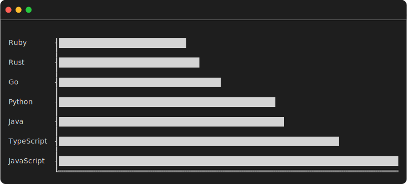

# chartscii-cli

> Transform data into stunning terminal charts in seconds.

<div align="center">

[](https://www.npmjs.com/package/chartscii-cli)
[](https://www.npmjs.com/package/chartscii-cli)
[](https://opensource.org/licenses/MIT)

</div>

```bash
chartscii data.csv -c auto
```



## Why chartscii?

**Fast.** Create beautiful charts in one command. No config files, no setup, just data.

**Flexible.** Works with any data source: numbers, CSV, JSON, stdin, or files.

**Beautiful.** Customizable colors, themes, and styling. Looks great in any terminal.

## Installation

```bash
npm install -g chartscii-cli
```

## Quick Start

```bash
# From numbers
chartscii 10 20 30 40 50

# From a file (auto-detected - no flag needed!)
chartscii data.csv
chartscii data.json

# From stdin
echo "1 2 3 4 5" | chartscii
seq 1 20 | chartscii

# From shell commands (auto-parsed!)
du -sh * | chartscii -c auto

# With options
chartscii 1 2 3 -c green -t "Sales" -p
```

## CLI-Unique Features

### 🎨 Auto Color Cycling
Use `--color auto` or `-c auto` to automatically cycle through colors for each bar:

```bash
chartscii data.csv -c auto
chartscii 10 20 30 40 50 -c auto -t "Rainbow Chart"
```

Colors cycle through: red → green → yellow → blue → purple → cyan → pink → orange → marine

### 📏 Opt-in Fill Character
The fill character is opt-in only. Use it three ways:

```bash
# No fill (default behavior)
chartscii 1 2 3

# Fill with default character (▒)
chartscii 1 2 3 -f
chartscii 1 2 3 --fill

# Fill with custom character
chartscii 1 2 3 -f "░"
chartscii 1 2 3 --fill "·"
```

### 🔍 Smart Data Parsing
Automatically handles shell command outputs with size suffixes and mixed formats:

```bash
# Parses "8.0K CONTRIBUTING.md" format
du -sh * | chartscii -t "File Sizes"

# Parses "CONTRIBUTING.md 8.0K" format
ls -lh | awk '{print $9" "$5}' | chartscii

# Extracts numbers from strings like "$1,500" or "Price: 99.99"
cat sales.txt | chartscii -c auto
```

Supports size suffixes: K, M, G, T (automatically converted to numeric values)

### 📁 Automatic File Detection
No need for a file flag - just pass the path:

```bash
chartscii data.json
chartscii stats.csv
chartscii /path/to/data.txt
```

### 📊 Stacked Charts (v4 Feature)
Full support for stacked bar charts with multiple segments:

```bash
# Stacked data with custom colors and labels
chartscii stacked.json \
  --stack-labels Frontend Backend DevOps \
  --stack-colors red green blue \
  --stack-value-labels
```

### 🎨 Advanced Styling (v4 Features)
New styling options for even more customization:

```bash
# Colored fill character
chartscii data.csv -f "." --fill-color blue

# Bar alignment (center, top, bottom, justify for horizontal)
chartscii 10 20 30 --align-bars center -h 10

# Vertical alignment (center, left, right, justify)
chartscii 10 20 30 -o vertical --align-bars center
```

## Quick Working Examples

Try these verified examples that work out of the box:

```bash
# Simple number sequence
seq 1 10 | chartscii -c auto -t "Numbers 1-10"

# File sizes in current directory
du -sh * | head -5 | chartscii -c auto -t "Top 5 Files"

# Count TypeScript files
find . -name "*.ts" | wc -l | chartscii -t "TypeScript Files"

# Fibonacci sequence visualization
echo "1 1 2 3 5 8 13 21 34 55" | tr ' ' '\n' | chartscii -t "Fibonacci" -c purple

# Random data
for i in {1..10}; do echo $((RANDOM % 100)); done | chartscii -c auto -t "Random"

# Lines of code per file
wc -l src/*.ts | grep -v total | awk '{print $2" "$1}' | chartscii -c green -t "LOC"

# Git commit count
git log --oneline | wc -l | chartscii -t "Total Commits" -c yellow

# Test results
npm test 2>&1 | grep "passing" | awk '{print "Passed "$1}' | chartscii -c green

# Stacked chart (v4) - using short aliases
chartscii examples/example-stacked.json -J Frontend Backend DevOps -I red green blue

# Fill with color (v4) - using short alias
echo "10 20 30" | chartscii -f "." -G blue -t "Colored Fill"
```

## Complete Options Reference

### Display Options

| Short | Long | Type | Default | Description |
|-------|------|------|---------|-------------|
| `-t` | `--title` | string | '' | Chart title |
| `-l` | `--labels` | boolean | true | Display labels |
| `-C` | `--color-labels` | boolean | true | Color labels |
| `-p` | `--percentage` | boolean | false | Display percentages |
| `-v` | `--value-labels` | boolean | false | Display value labels on bars |
| `-P` | `--value-labels-prefix` | string | '' | Prefix for value labels (e.g., "$", "€") |
| `-V` | `--value-labels-floating-point` | number | 2 | Decimal places for value labels |

### Layout Options

| Short | Long | Type | Default | Description |
|-------|------|------|---------|-------------|
| `-o` | `--orientation` | string | 'horizontal' | Chart orientation (horizontal, vertical) |
| `-w` | `--width` | number | 80 | Chart width |
| `-h` | `--height` | number | 20 | Chart height |
| `-b` | `--bar-size` | number | 1 | Bar size (thickness) |
| `-d` | `--padding` | number | 1 | Padding between bars |

### Styling Options

| Short | Long | Type | Default | Description |
|-------|------|------|---------|-------------|
| `-c` | `--color` | string | '' | Bar color (name, hex, ANSI, or **`auto`** for cycling) |
| `-k` | `--theme` | string | '' | Color theme (see themes below) |
| `-z` | `--char` | string | '█' | Character for bars |
| `-f` | `--fill` | string | undefined | **Opt-in** fill character (▒ if flag alone, custom if value) |
| `-G` | `--fill-color` | string | '' | Color for the fill character |
|  | `--scale` | string | 'auto' | Scale mode (auto or number for max value) |
| `-E` | `--align-bars` | string | '' | Bar alignment (horizontal: top/center/bottom/justify, vertical: left/center/right/justify) |

### Structure Options

| Short | Long | Type | Default | Description |
|-------|------|------|---------|-------------|
| `-n` | `--naked` | boolean | false | Display without structure characters |
| `-x` | `--structure-x` | string | '═' | Horizontal structure character |
| `-y` | `--structure-y` | string | '╢' | Vertical structure character |
| `-a` | `--structure-axis` | string | '║' | Axis structure character |
| `-q` | `--structure-bottom-left` | string | '╚' | Bottom-left corner character |

### Data Options

| Short | Long | Type | Default | Description |
|-------|------|------|---------|-------------|
| `-s` | `--sort` | boolean | true | Sort data |
| `-r` | `--reverse` | boolean | false | Reverse the chart |

### Stacked Chart Options

| Short | Long | Type | Default | Description |
|-------|------|------|---------|-------------|
| `-I` | `--stack-colors` | array | [] | Colors for stacked segments (space-separated) |
| `-J` | `--stack-labels` | array | [] | Labels for stacked segments (space-separated) |
| `-K` | `--stack-value-labels` | boolean | false | Show value labels on stacked segments |

### Utility Options

| Short | Long | Type | Default | Description |
|-------|------|------|---------|-------------|
|  | `--list-themes` | boolean | false | List all available color themes |
|  | `--help`, `-?` | boolean | | Show help |
|  | `--version` | boolean | | Show version |

## Examples

### Basic Charts

```bash
# Simple bar chart
chartscii 5 10 15 20 25
```
```
5  ╢████████████████
10 ╢████████████████████████████████
15 ╢████████████████████████████████████████████████
20 ╢████████████████████████████████████████████████████████████████
25 ╢████████████████████████████████████████████████████████████████████████████████
   ╚════════════════════════════════════════════════════════════════════════════════
```

```bash
# Vertical chart
chartscii 1 2 3 4 5 -o vertical -h 10
```
```
║        █
║        █
║      █ █
║      █ █
║    █ █ █
║    █ █ █
║  █ █ █ █
║  █ █ █ █
║█ █ █ █ █
║█ █ █ █ █
╚═════════
 1 2 3 4 5
```

### Using Auto Colors

```bash
# Cycle through colors automatically
chartscii 10 20 30 40 50 -c auto -t "Sales by Region"
```

Each bar will have a different color: red, green, yellow, blue, purple, etc.

```bash
# Combine with themes
chartscii data.csv -c auto -k neon -t "Neon Rainbow"
```

### Using Fill Characters

```bash
# Default fill character (▒)
chartscii 1 2 3 -f

# Custom fill character
chartscii 1 2 3 -f "░" -c green

# ASCII-friendly fill
chartscii 1 2 3 -f "." -c blue
```

### Value Labels

```bash
# Show values on bars
chartscii 100 250 500 -v

# With currency prefix
chartscii 100 250 500 -v -P '$'

# With custom precision
chartscii 1.234 5.678 9.012 -v -V 3

# Combine prefix and precision
chartscii 99.99 149.99 199.99 -v -P '€' -V 2
```

### Stacked Charts (v4)

```bash
# Simple stacked chart from JSON file
chartscii examples/example-stacked.json

# With stack labels and colors (using long options)
chartscii examples/example-stacked.json \
  --stack-labels Frontend Backend DevOps \
  --stack-colors red green blue \
  --stack-value-labels

# Same with short aliases
chartscii examples/example-stacked.json -J Frontend Backend DevOps -I red green blue -K

# JSON format for stacked data
cat > stacked.json << 'EOF'
[
  {
    "label": "Q1",
    "value": [100, 50, 25],
    "color": "blue"
  },
  {
    "label": "Q2",
    "value": [120, 60, 30]
  }
]
EOF
chartscii stacked.json -J Sales Support Marketing -I cyan yellow purple
```

### Advanced Styling (v4)

```bash
# Colored fill character (long and short)
chartscii 10 20 30 -f "." --fill-color blue -t "Blue Fill"
chartscii 10 20 30 -f "." -G cyan -t "Cyan Fill"

# Bar alignment - horizontal (long and short)
chartscii 10 20 30 --align-bars center -h 10 -t "Centered Bars"
chartscii 10 20 30 -E top -h 10 -t "Top Aligned"

# Bar alignment - vertical (long and short)
chartscii 10 20 30 -o vertical --align-bars center -w 60 -t "Centered Vertical"
chartscii 10 20 30 -o vertical -E left -w 60 -t "Left Aligned"
```

### Themes

```bash
# List all available themes
chartscii --list-themes
```

Available themes:
- default, pastel, lush, standard
- beach, nature, neon, spring
- pinkish, crayons, sunset, rufus
- summer, autumn, mint, vintage
- sport, rainbow, pool, champagne

```bash
# Use a theme
chartscii data.json -k pastel -p
chartscii 10 20 30 -k neon -c auto
chartscii 5 10 15 -k rainbow -f
```

### File Inputs

**JSON** (data.json):
```json
[10, 20, 30, 40, 50]
```

Or with labels:
```json
[
  {"label": "Jan", "value": 100},
  {"label": "Feb", "value": 150},
  {"label": "Mar", "value": 200}
]
```

**CSV** (data.csv):
```csv
JavaScript,68
TypeScript,56
Python,43
```

```bash
# Auto-detected file types
chartscii data.json
chartscii data.csv -p -t "Languages"
```

Output:
```
Languages
Python (25.75%)     ╢███████████████████████████████████████████████████
                    ║
TypeScript (33.53%) ╢██████████████████████████████████████████████████████████████████
                    ║
JavaScript (40.72%) ╢████████████████████████████████████████████████████████████████████████████████
                    ╚════════════════════════════════════════════════════════════════════════════════
```

### Shell Command Integration

```bash
# Disk usage (auto-parsed with size suffixes!)
du -sh * | chartscii -c auto -t "Disk Usage"

# Process memory usage
ps aux | awk 'NR>1 {print $11" "$4}' | head -10 | chartscii -t "Top Memory"

# File sizes in current directory
ls -lh *.ts | awk '{print $9" "$5}' | chartscii -c auto -t "File Sizes"

# Disk usage by mount point
df -h | awk 'NR>1 {print $6" "$5}' | head -5 | chartscii -t "Disk Usage %"

# Count files by extension
find . -type f -name "*.ts" | wc -l | chartscii -t "TypeScript Files"

# Count test results
npm test 2>&1 | grep "passing" | awk '{print $1}' | chartscii -t "Tests Passing"
```

### Advanced Customization

```bash
# Custom scale
chartscii 10 20 30 --scale 100 -t "Progress"

# Naked mode (no borders)
chartscii 1 2 3 -n -c red

# Custom structure characters
chartscii 1 2 3 -x "─" -y "│" -a "┃" -q "└"

# Everything combined
chartscii data.csv -c auto -f "░" -v -P '$' -V 0 -p -k pastel -t "Sales Report" -w 100
```

## Real-World Use Cases

### DevOps & Monitoring

```bash
# Disk usage by directory
du -sh */ | chartscii -c auto -t "Directory Sizes"

# Docker container stats (if Docker installed)
docker stats --no-stream --format "{{.Name}} {{.MemPerc}}" | chartscii -t "Container Memory"

# Kubernetes pod CPU (if kubectl available)
kubectl top pods | awk 'NR>1 {print $1" "$2}' | chartscii -c auto -t "Pod CPU"

# System disk usage
df -h | awk 'NR>1 {print $6" "$5}' | chartscii -t "Disk Usage"

# Process count by user
ps aux | awk 'NR>1 {print $1}' | sort | uniq -c | sort -rn | head -10 | chartscii -c blue
```

### Git Analytics

```bash
# Commits by date
git log --format=%ad --date=short | head -20 | uniq -c | chartscii -c green -t "Commits by Date"

# Files in repository by type
find . -type f -name "*.ts" -o -name "*.js" -o -name "*.json" | \
  sed 's/.*\.//' | sort | uniq -c | chartscii -c auto -t "Files by Type"

# Lines of code by file
wc -l src/*.ts | grep -v total | awk '{print $2" "$1}' | chartscii -t "Lines of Code"

# Recent commit activity (last 10 commits)
git log -10 --format=%ad --date=short | uniq -c | chartscii -c yellow -t "Recent Activity"
```

### File System Analysis

```bash
# Largest files in directory
ls -lhS | awk 'NR>1 && NR<11 {print $9" "$5}' | chartscii -c auto -t "Largest Files"

# Directory sizes sorted
du -sh */ | sort -hr | head -10 | chartscii -c auto -t "Top Directories"

# File count by directory
find . -maxdepth 1 -type d | while read d; do echo "$d $(find "$d" -type f | wc -l)"; done | \
  tail -n +2 | chartscii -t "Files per Directory"

# Code vs test file sizes
du -sh src/*.ts | grep -v test | chartscii -c green -t "Source Files" && \
du -sh src/*.test.ts | chartscii -c red -t "Test Files"
```

### Development Workflow

```bash
# Test results
npm test 2>&1 | grep "passing" | awk '{print "Passing "$1}' | chartscii -c green

# Package.json dependencies count
cat package.json | jq -r '.dependencies | keys[]' | wc -l | chartscii -t "Dependencies"

# TypeScript files count
find . -name "*.ts" -not -path "./node_modules/*" | wc -l | chartscii -t "TS Files"

# Build output sizes
ls -lh dist/ 2>/dev/null | awk 'NR>1 {print $9" "$5}' | chartscii -c auto -t "Build Artifacts"

# Git branches count
git branch | wc -l | chartscii -t "Local Branches"
```

### Data Analysis (with external data)

```bash
# CSV column analysis
cat data.csv | cut -d, -f2 | chartscii -p -t "Sales Distribution"

# JSON parsing
echo '[{"value":10},{"value":20},{"value":30}]' | jq '.[].value' | chartscii -t "JSON Data"

# Generate sequence and chart
seq 10 | awk '{print $1*$1}' | chartscii -t "Squares" -c purple

# Random data visualization
for i in {1..10}; do echo $((RANDOM % 100)); done | chartscii -c auto -t "Random Data"
```

## Data Format Support

chartscii automatically detects and parses multiple formats:

### Plain Numbers
```bash
chartscii 1 2 3 4 5
echo "10 20 30" | chartscii
seq 1 100 | chartscii
```

### Size Suffixes (K, M, G, T)
```bash
echo "8.0K 44M 1.2G" | chartscii
du -sh * | chartscii  # Automatically handles sizes
```

### Label + Number
```bash
echo -e "Item1 10\nItem2 20\nItem3 30" | chartscii
ps aux | awk '{print $11" "$4}' | chartscii
```

### Number + Label
```bash
echo -e "10 Item1\n20 Item2\n30 Item3" | chartscii
du -sh * | chartscii  # Handles "8.0K filename" format
```

### Mixed String/Number
```bash
echo -e "Price: $99.99\nCost: $149.99" | chartscii  # Extracts numbers
cat report.txt | chartscii  # Finds numbers in any text
```

## Tips & Tricks

### Shell Aliases
Add to your `.bashrc` or `.zshrc`:

```bash
alias chart="chartscii"
alias vchart="chartscii -o vertical"
alias pchart="chartscii -p"
alias autochart="chartscii -c auto"
```

### Watch Mode for Live Data
```bash
# Monitor file count in real-time
watch -n 1 "find . -name '*.ts' | wc -l | chartscii -t 'TS Files'"

# Track disk usage
watch -n 5 "du -sh */ | chartscii -c auto -t 'Directory Sizes'"

# Monitor git commits over time
watch -n 10 "git log --oneline | wc -l | chartscii -t 'Total Commits'"
```

### Dashboard with tmux
```bash
#!/bin/bash
# Create a monitoring dashboard

tmux new-session -d -s chart-dash

# Split into 3 panes
tmux split-window -h
tmux split-window -v

# Disk usage
tmux send-keys -t 0 'watch -n 5 "du -sh */ | head -5 | chartscii -c auto -t Disk"' C-m

# File counts
tmux send-keys -t 1 'watch -n 5 "find . -maxdepth 1 -type f | wc -l | chartscii -t Files"' C-m

# Git activity
tmux send-keys -t 2 'watch -n 10 "git log --oneline -10 | wc -l | chartscii -t Commits"' C-m

tmux attach -t chart-dash
```

### Combine with fzf
```bash
# Interactive file selection and visualization
find . -name "*.log" | fzf | xargs cat | grep ERROR | chartscii -c red
```

### One-liner Scripts
```bash
# Top 10 largest directories
du -sh */ | sort -rh | head -10 | chartscii -c auto -t "Top Directories"

# Count files by extension
find . -type f | sed 's/.*\.//' | sort | uniq -c | sort -rn | head -10 | chartscii -c auto -t "Files by Type"

# Repository line counts
wc -l src/*.ts | grep -v total | sort -rn -k1 | head -10 | awk '{print $2" "$1}' | chartscii -c green -t "Largest Files"

# Recent git activity
git log --since="7 days ago" --format=%ad --date=short | sort | uniq -c | chartscii -c yellow -t "Commits This Week"

# Generate Fibonacci sequence
echo "1 1 2 3 5 8 13 21 34 55" | tr ' ' '\n' | chartscii -t "Fibonacci" -c purple

# Process distribution (top users)
ps aux | awk 'NR>1 {print $1}' | sort | uniq -c | sort -rn | head -5 | chartscii -c blue -t "Processes by User"
```

## Performance

- **Ultra fast** - < 100ms for most datasets
- **Efficient parsing** - Handles large datasets
- **Minimal dependencies** - Small install size
- **Memory efficient** - Streams large files
- **Smart detection** - Auto-detects formats without configuration

## Why Terminal Charts?

✅ **Universal** - Works on any system with a terminal
✅ **Scriptable** - Easy to automate and integrate
✅ **SSH-friendly** - Visualize data on remote servers
✅ **CI/CD ready** - Perfect for build pipelines
✅ **No browser needed** - Lightweight and fast
✅ **Git-friendly** - Text-based, version controllable

## API

chartscii-cli is built on [chartscii](https://github.com/tool3/chartscii), a powerful charting library. You can use chartscii programmatically in your Node.js projects:

```javascript
const Chartscii = require('chartscii');

const chart = new Chartscii([1, 2, 3, 4, 5], {
  title: 'My Chart',
  color: 'green'
});

console.log(chart.create());
```

## Contributing

Found a bug? Have a feature request? PRs welcome!

```bash
git clone https://github.com/tool3/chartscii-cli
cd chartscii-cli
npm install
npm test
npm run build
```

## License

MIT © [Tal Hayut](https://github.com/tool3)

---

<div align="center">

**Made with ❤️ for developers who love the terminal**

[⭐ Star on GitHub](https://github.com/tool3/chartscii-cli) • [📦 View on npm](https://www.npmjs.com/package/chartscii-cli) • [🐛 Report Bug](https://github.com/tool3/chartscii-cli/issues)

</div>
